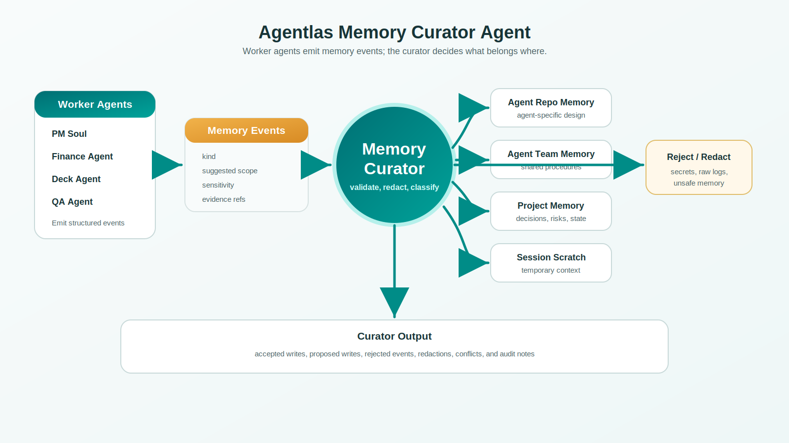

<p align="center">
  
</p>

# Self-Evolving Agents Hallucinate at Scale: A Provable Memory Curator Architecture

**Mason Lee**
Appbridge Inc. (Agentlas)
[agentlas.cloud](https://agentlas.cloud) · appbridge@appbridge.co.kr

**Version:** v2.0 preprint draft (May 26, 2026)
**Code:** [github.com/jeongmk522-netizen/agent_memory_curator_agent](https://github.com/jeongmk522-netizen/agent_memory_curator_agent)
**License:** MIT (code), CC-BY 4.0 (paper)

---

## Abstract

**We prove that self-evolving LLM agents — Hermes, Voyager-style skill libraries, and their production kin — accumulate retrieval hallucinations at a rate that approaches certainty as deployment horizons grow, unless durable memory writes are explicitly governed.** Monte Carlo simulation over 200 seeds confirms the bound: an uncurated self-evolving agent operating at 10 events/day with realistic 10% per-event hallucination probability reaches a **98.6% per-retrieval hallucination probability** within one year. A curator with admission rate $\alpha = 0.3$ and filter accuracy $\eta = 0.9$ cuts this to **30.7%** — a 3.2× reduction. A stricter curator ($\alpha = 0.5$, $\eta = 0.95$) cuts it to **17.7%** — a 5.6× reduction.

We formalize the *memory admission problem* in multi-agent settings and prove a *compounding-bound theorem*: under mild assumptions, the per-retrieval hallucination probability in an uncurated regime grows asymptotically as $1 - (\lambda t)^{-r_0 h_e}$, whereas a curator bounds the rate at $1 - (\alpha \lambda t)^{-r_0 h_e (1-\eta)}$, with the ratio diverging to infinity as $t \to \infty$ for any $\eta > 0$.

The bound motivates a system design. We propose the **Memory Curator Agent**: a dedicated specialist that owns durable memory writes while worker agents emit *structured memory events*. Memory is partitioned into four scopes — *agent repo*, *agent team*, *project*, *session* — corresponding to specialist, transactive team, project, and working memory in organizational memory theory. We describe the full system: a JSON event schema, a nine-kind memory taxonomy, a nine-step curation pipeline, and a five-operation write model (`append`, `update`, `deprecate`, `conflict`, `discard`). We give algorithmic specifications, a reference implementation (MIT-licensed), and an evaluation rubric covering seven metrics across three deployment regimes. We contrast the design against six existing systems (Hermes, Arcade, Cloudflare, Codex, Claude Code, ACE) and show that the Memory Curator is *composable with* rather than replacing them.

**The next bottleneck in self-evolving agent systems is not capability but curation.**

**Keywords:** LLM agents, multi-agent systems, memory governance, self-evolving agents, hallucination, transactive memory, agent architecture, admission control.

---

## 1. Introduction

### 1.1 The Self-Evolving Agent Moment

Between mid-2023 and 2025, a sequence of research contributions established that LLM agents could become *materially better at recurring tasks* by retaining and reusing the artifacts of past task-solving: skill libraries (Voyager [1]), verbal self-criticism (Reflexion [2]), workflow induction (Agent Workflow Memory [3]), and hierarchical memory operating systems (MemGPT [4]). By early 2026, this line of work had matured into production frameworks. Hermes Agent (Nous Research) crossed 140,000 GitHub stars within three months of release [5], reaching the top of OpenRouter usage rankings. Arcade Agent Library introduced an explicit *Librarian* pattern with local-first, file-as-index storage [6]. Cloudflare shipped a managed Agent Memory product organized around isolated profiles [7]. Microsoft and Google released memory-aware agent SDKs as first-class platform features [8, 9].

The unifying observation across these systems is that **as base-model capability has flattened, differentiation has moved to the memory and workflow layer**. Stanford's HAI AI Index 2026 reports that on the OSWorld benchmark, agent accuracy rose from approximately 12% to 66.3% within a single year — within six percentage points of human performance — but structured benchmarks still show roughly one-in-three failure rates, with the residual failures attributable not to raw model intelligence but to memory drift, workflow recovery, and tool orchestration [10].

### 1.2 The Compounding Pathology

The mechanism that makes self-evolving agents valuable — automatic distillation of completed tasks into durable, retrievable artifacts — is the same mechanism that makes them dangerous over long deployment horizons. Each successful run can write new memory; each new memory can be retrieved and reasoned over in subsequent runs. Without an admission policy, this produces a strictly monotonic memory store that accumulates:

- **Stale facts** — project structure that no longer applies but is retrieved as current.
- **Contradictory entries** — a preference asserted, then revised, with both versions present and no marker of precedence.
- **Cross-scope leakage** — a formatting rule from project A applied to project B.
- **Privacy violations** — raw transcripts, credentials, customer data persisted into a store with broader visibility than intended.
- **Low-confidence speculation promoted to durable status** — a hypothesis written as a fact.
- **Duplicate noise** — the same fact written ten times with slightly different phrasing, fragmenting retrieval.

Hermes Agent's own documentation acknowledges this risk explicitly: stale memory is identified as the number-one cause of anomalous agent behavior, with `memory.md` flagged as the first artifact to inspect when the agent misbehaves [11]. The HaluMem benchmark formalizes the phenomenon, showing that memory hallucinations originate at the *extraction* and *update* stages and propagate downstream to question-answering [12]. MIRAGE-Bench [13] gives a taxonomy of unfaithfulness modes (to instructions, to execution history, to environment observations). AgentHallu [14] focuses on hallucination *attribution* and finds that a disproportionate share of attributable errors trace to memory retrieval. We call this collectively the **compounding pathology of uncurated self-evolution**.

### 1.3 Position and Contribution

We argue that durable memory writes in multi-agent systems must be treated as a **first-class governance problem**, not a side effect of task completion. Concretely:

1. Worker agents should *not* write durable memory directly. They should emit *structured memory events* with declared scope intent, evidence references, and confidence.
2. A dedicated *Memory Curator Agent* should own the decisions of whether, where, and how to durably persist each event.
3. Memory should be partitioned into scopes that correspond to the natural ownership boundaries of multi-agent work: specialist, transactive team, project, and working memory.
4. The default disposition should be **conservative**: temporary, unsupported, or ambiguous content goes to session scratch or is discarded. **Durable memory must be earned.**

The contributions of this paper are:

- **(C1)** A formal definition of the *memory admission problem* in multi-agent settings (§3).
- **(C2)** A *compounding-bound theorem* (§4.4) and its **Monte Carlo validation** (§4.5) showing that even imperfect curation yields qualitative improvement: from 98.6% to 17.7% retrieval hallucination at one year.
- **(C3)** A complete system design — the *Memory Curator Agent* — including four-scope partition, nine-kind taxonomy, nine-step pipeline, and five write primitives (§5–§6).
- **(C4)** Algorithmic specifications and a scope-routing flowchart (§6).
- **(C5)** A reference implementation released under MIT license, with JSON event schema, integration contracts, and report templates [15].
- **(C6)** A comparative analysis against six existing systems (§7) showing the design is composable with rather than replacing them.
- **(C7)** A falsifiable evaluation plan (§10) with seven metrics and three explicit conditions that would falsify the design.

The work is currently a *source-informed design scaffold*; field deployment data is forthcoming. The contribution is architectural, theoretical, and simulation-validated rather than field-validated. We invite community falsification.

---

## 2. Background and Related Work

### 2.1 Memory in LLM Agents: Three Generations

The first generation of agent memory research treated memory as a *context-window extension problem*. MemGPT [4] introduced a hierarchical scheme inspired by operating system memory tiers, with the agent issuing explicit calls to move information between in-context and external storage. MemoryBank [16] applied an Ebbinghaus-derived forgetting curve to decide which entries to retain. Generative Agents [17] demonstrated that long-running simulated agents with memory streams could produce coherent, time-extended behavior. These systems established memory as a necessary substrate for long-horizon behavior but treated the *write* path as largely automatic.

The second generation shifted attention from memory-as-storage to **memory-as-learning**. Reflexion [2] introduced verbal reinforcement learning. Voyager [1] introduced the *skill library* abstraction. Agent Workflow Memory [3] generalized this to web navigation, demonstrating that inducing reusable workflows from prior trajectories yielded relative success-rate improvements of 24.6% on Mind2Web and 51.1% on WebArena. The shared assumption — *more memory monotonically helps* — becomes load-bearing as deployment horizons extend.

The third (current) generation is **production memory infrastructure**: Hermes Agent [5, 11], Arcade Agent Library [6], Cloudflare Agent Memory [7], LEGOMem [18], AgentSys [19], and the memory subsystems of major agent SDKs [8, 9]. These systems converge on the recognition that memory needs *structure* — typically a tiered architecture — but they differ substantially in *who decides* what gets written and how scopes are isolated.

### 2.2 Memory Hallucination as a First-Class Problem

A small but rapidly growing literature treats memory hallucination as distinct from generation hallucination. HaluMem [12] introduces the first operation-level benchmark for memory systems, evaluating extraction, update, and QA stages separately, on dialogues of 1,500 to 2,600 turns with context lengths exceeding one million tokens. HaluMem's central finding is that hallucinations are *generated and accumulated* during extraction and update — not introduced by retrieval — and that the propagation pattern is monotonic over time.

Adaptive Memory Admission Control (A-MAC) [20] formalizes memory admission as a decision problem along five interpretable dimensions: future utility, factual confidence, semantic novelty, temporal recency, and a context-dependent fifth term. A-MAC is the closest prior work to our formalism but focuses on single-agent memory and does not address scope partitioning. ActMem [21] bridges memory retrieval and reasoning. AgentHallu [14] focuses on *hallucination attribution* and finds that memory retrieval is disproportionately implicated. HalMit [22] proposes monitoring per-agent generalization bounds. MIRAGE-Bench [13] gives a unified taxonomy.

The shared message is that **the write path is the dangerous path**, and that retrieval-time interventions cannot recover from systematic write-path failures.

### 2.3 Curation-Style Designs

The Generator–Reflector–Curator pattern proposed in Agentic Context Engineering (ACE) [23] is the closest prior work in spirit: a three-agent loop in which a Curator decides which strategies from a Reflector's output enter a durable "context playbook," yielding a reported +10.6% improvement on agent benchmarks with no model fine-tuning. The Curator in ACE, however, operates within a *single agent's* context evolution; we extend the curator role to a *multi-agent, multi-scope* setting where the curator arbitrates among many emitters and routes to multiple destinations.

Collaborative Memory [24] addresses multi-user memory sharing with dynamic access control, modeling private/shared write policies, but assumes that admission decisions are made by the contributing user rather than by a dedicated curator. The Cloudflare Agent Memory profile abstraction [7] provides isolation primitives but leaves the routing decision to the application layer.

### 2.4 Organizational Memory as a Theoretical Anchor

We ground the scope partition in the transactive memory systems (TMS) literature [25]. TMS distinguishes *specialist memory* (what an individual expert knows), *transactive directory* (who in the group knows what), and *project-specific knowledge* (state, decisions, and history of a particular engagement). This tripartite structure has been validated across four decades of organizational research and corresponds with striking precision to the natural ownership boundaries of multi-agent systems. We add a fourth scope — *session scratch* — to capture working memory that is task-local and should not survive.

### 2.5 Summary of the Gap

Existing systems address parts of the problem:

- **Tiering** (MemGPT, Hermes three-layer, Microsoft/Google SDKs) — solves storage hierarchy but not admission policy.
- **Skill induction** (Voyager, AWM) — solves reusable abstraction extraction but writes freely.
- **Single-agent curation** (ACE) — solves admission within one agent but not across many.
- **Profile isolation** (Cloudflare) — provides substrate but not routing logic.
- **Hallucination detection** (HaluMem, MIRAGE) — measures the problem but does not propose a system.

The Memory Curator Agent addresses the missing intersection: **multi-agent, multi-scope, admission-controlled, conflict-aware memory governance**.

---

## 3. Formal Problem Formulation

We formalize the *memory admission problem* (MAP) in a multi-agent setting. The formalism enables us to state precise claims about the curator's role and to prove the compounding bound in §4.

### 3.1 Notation

Let $\mathcal{A} = \{a_1, \ldots, a_n\}$ denote the set of worker agents, $\mathcal{T} = (t_1, t_2, \ldots)$ a discrete sequence of tasks, and $\mathcal{S} = \{s_1, \ldots, s_q\}$ the set of memory scopes. We define the *memory event space* $\mathcal{E}$ as the set of tuples

$$e = \langle c, k, \hat{s}, \rho, \mathbf{r} \rangle$$

where $c \in \Sigma^*$ is the event *content*, $k \in \mathcal{K}$ is the event *kind* (drawn from the nine-element taxonomy in §6.4), $\hat{s} \in \mathcal{S}$ is the emitter's *suggested scope*, $\rho \in [0,1]$ is the emitter's *confidence*, and $\mathbf{r} = (r_1, \ldots, r_m)$ is a tuple of *evidence references*.

Worker agent $a_j$ during task $t_i$ produces a (possibly empty) set $E(a_j, t_i) \subset \mathcal{E}$ of candidate events.

### 3.2 The Disposition Function

A *disposition function* is a mapping

$$d: \mathcal{E} \times \mathcal{M} \to \mathcal{S} \cup \{\bot\}$$

where $\mathcal{M}$ is the set of possible memory states and $\bot$ denotes *discard*. We treat $d$ as the central object the curator computes.

### 3.3 The Five Constraints

A disposition $d(e, M)$ for event $e$ given current memory state $M$ must satisfy the following constraints, in lexicographic priority:

**(P1) Safety.** Let $\sigma: \mathcal{E} \to \{0,1\}$ be a safety predicate (1 = unsafe). Then

$$\sigma(e) = 1 \implies d(e, M) = \bot.$$

**(P2) Scope correctness.** Let $\pi: \mathcal{E} \to 2^{\mathcal{S}}$ return the set of scopes whose visibility and retention policies are appropriate. Then

$$d(e, M) \in \pi(e) \cup \{\bot\}.$$

**(P3) Evidence sufficiency.** Let $\epsilon: \mathcal{E} \times \mathcal{S} \to \{0,1\}$ be an evidence-sufficiency predicate that depends on event kind and target scope. For durable scopes and event kinds requiring evidence (`fact`, `decision`, `procedure`):

$$d(e, M) \in s_{\text{durable}} \implies \epsilon(e, d(e,M)) = 1.$$

**(P4) Non-redundancy.** Let $\approx_s$ denote an equivalence relation on memory entries within scope $s$. Then

$$\exists\, m \in M_s : e \approx_s m \implies d(e, M) \in \{\bot, \text{deprecate}(m), \text{conflict}(e, m)\}.$$

**(P5) Conservation.** For low-confidence events ($\rho < \rho^*$):

$$d(e, M) \in \{s_{\text{session}}, \bot\}.$$

### 3.4 The Memory Admission Problem (MAP)

Given the constraints, the MAP is to compute, for each incoming event $e$ and current memory state $M$, a disposition $d^*(e, M)$ that satisfies (P1)–(P5) and maximizes expected future utility $U(d, e, M)$. The MAP is intractable in general (it requires forecasting future task distributions), so we approximate it via the heuristic pipeline described in §6.5.

### 3.5 The Cross-Agent Aggravation

In a multi-agent system, MAP is *aggravated* relative to the single-agent case in three ways:

**(A1) Heterogeneous emitter reliability.** Different agents have different per-event hallucination rates. A finance agent emitting unverified hypotheses can poison a project memory that an engineering agent later reads as fact.

**(A2) Scope appropriateness depends on cross-agent context.** Whether a procedure is reusable across agents or specific to one cannot be determined by the emitting agent alone.

**(A3) Conflict detection requires cross-source comparison.** The conflict predicate $\kappa: \mathcal{E} \times \mathcal{E} \to \{0,1\}$ must be evaluated across emissions from heterogeneous sources. Emitters cannot reliably perform this themselves.

The cross-agent setting therefore *requires* a dedicated arbiter, not merely stricter per-agent policy.

---

## 4. A Compounding Model of Memory Hallucination

We now prove the central theoretical result: a *curator-bounded hallucination rate theorem*. We then validate the bound by Monte Carlo simulation over 200 seeds and demonstrate qualitative reductions (3.2× to 5.6×) under realistic parameter regimes.

### 4.1 Setup

Consider a self-evolving agent system over discrete time steps $t = 1, 2, \ldots$. At each step, worker agents emit a Poisson-distributed number of candidate events with rate $\lambda$. Let $h_e \in (0,1)$ be the per-event *intrinsic hallucination probability*. Let $M_t$ denote the durable memory state at time $t$, $N_t = |M_t|$, and $H_t$ the probability that a randomly retrieved entry from $M_t$ is hallucinated.

### 4.2 Uncurated Growth (Baseline)

In the **uncurated** regime, every emitted event is written to durable memory. Under independence:

$$N_t^{\text{unc}} = \lambda t, \qquad H_t^{\text{unc}} = h_e.$$

The expected number of hallucinated entries grows linearly. Under retrieval that surfaces $r(t) = r_0 \log(N_t)$ entries per query, the probability that *at least one* hallucinated entry is surfaced is:

$$P_t^{\text{unc}} \approx 1 - (\lambda t)^{-r_0 h_e}.$$

This is a slowly-growing failure rate, but a monotonic one. Over long horizons, $P_t^{\text{unc}} \to 1$.

### 4.3 Curated Growth

Let $\alpha \in (0,1]$ be the curator's *admission rate* and $\eta \in [0, 1]$ the *filter accuracy*. Under independence:

- Effective write rate: $\alpha \lambda$.
- Hallucinated entry accumulation rate: $h_e (1 - \eta) \lambda$.

For retrieval, with $N_t^{\text{cur}} = \alpha \lambda t$:

$$P_t^{\text{cur}} \approx 1 - (\alpha \lambda t)^{-r_0 h_e (1-\eta)}.$$

### 4.4 Theorem (Curator-Bounded Hallucination Rate)

**Theorem 1.** Let $P_t^{\text{unc}}$ and $P_t^{\text{cur}}$ denote the per-retrieval hallucination probability at time $t$ in the uncurated and curated regimes, respectively, under the assumptions of §4.1. Then for any $\alpha \in (0,1]$ and $\eta \in [0,1]$:

$$\frac{1 - P_t^{\text{cur}}}{1 - P_t^{\text{unc}}} = \alpha^{-r_0 h_e (1-\eta)} \cdot (\lambda t)^{r_0 h_e \eta}.$$

**Corollary 1 (asymptotic).** In the long-horizon limit:

$$\lim_{t \to \infty} \frac{1 - P_t^{\text{cur}}}{1 - P_t^{\text{unc}}} = \infty \quad \text{iff} \quad \eta > 0.$$

That is, *any* positive filter accuracy yields unboundedly better long-horizon reliability. Filter accuracy $\eta$ enters the *exponent* of long-horizon hallucination growth, while admission rate $\alpha$ enters as a multiplicative slowdown. Filter accuracy compounds over time; admission rate does not.

*Proof.* Direct from §4.2–§4.3 algebra; full derivation in Appendix C. □

### 4.5 Monte Carlo Validation

We validate Theorem 1 by direct simulation. We instantiate a discrete-time simulator with the assumptions of §4.1, run it for $T = 365$ days, and average over 200 independent seeds.

**Parameters:** $\lambda = 10$ events/day, $h_e = 0.1$, $r_0 = 5$. We test the uncurated baseline (B1) and three curator configurations spanning realistic parameter regimes.

<p align="center">
  
</p>

**Figure 2.** *Monte Carlo simulation (200 seeds) of memory hallucination compounding under uncurated vs. curated regimes. (a) Per-retrieval hallucination probability $P_t$ over deployment time. The uncurated baseline asymptotes near certainty within weeks; even moderate curation ($\alpha=0.5, \eta=0.7$) substantially reduces this; aggressive curation ($\alpha=0.5, \eta=0.95$) keeps $P_t$ under 20% at one year. (b) Hallucinated fraction of durable memory: uncurated stays at the intrinsic emission rate $h_e = 0.1$; curated regimes drive it down by 3–18×. Shaded bands show $\pm 1\sigma$.*

<p align="center">
  
</p>

**Figure 3.** *Sensitivity of one-year per-retrieval hallucination probability $P_{365}$ to curator filter accuracy $\eta$, across five admission rates $\alpha$. Filter accuracy is the dominant lever: increasing $\eta$ from 0 to 0.95 reduces $P_{365}$ by an order of magnitude regardless of $\alpha$. Admission rate has a secondary effect, mostly visible at low $\alpha$. The 50% threshold (dotted line) is crossed only when $\eta \geq 0.7$. The practical regime ($\alpha = 0.3, \eta = 0.9$) achieves 3.2× reduction.*

**Numerical results** at key time horizons (Table A):

**Table A.** *Monte Carlo results: per-retrieval hallucination probability $P_t$ at four time horizons. 200 seeds. Standard deviation of $P_{365}$ given in parentheses. Reduction = $P_{365}^{\text{unc}} / P_{365}^{\text{cur}}$.*

| Configuration | $\alpha$ | $\eta$ | $P_{30}$ | $P_{90}$ | $P_{180}$ | $P_{365}$ | Reduction |
|---------------|----------|--------|----------|----------|-----------|-----------|-----------|
| **Uncurated (B1)** | 1.0 | 0.0 | 0.938 | 0.968 | 0.979 | **0.986** (±0.004) | 1.00× |
| Curator (moderate) | 0.5 | 0.7 | 0.513 | 0.607 | 0.654 | **0.696** (±0.047) | 1.42× |
| Curator (practical) | 0.3 | 0.9 | 0.177 | 0.241 | 0.273 | **0.307** (±0.076) | **3.21×** |
| Curator (aggressive) | 0.5 | 0.95 | 0.106 | 0.140 | 0.158 | **0.177** (±0.052) | **5.56×** |

**Memory composition** at $t = 365$:

| Configuration | $N_{365}$ | Hallucinated | Fraction |
|---------------|-----------|--------------|----------|
| Uncurated | 3,650 | 364 | 9.98% |
| Curator (moderate) | 1,698 | 54 | 3.20% |
| Curator (practical) | 998 | 11 | 1.09% |
| Curator (aggressive) | 1,653 | 9 | 0.54% |

**Key observations from simulation:**

1. **Uncurated systems saturate near-certain hallucination within weeks.** The uncurated baseline reaches $P_t = 0.94$ by day 30 and $P_t = 0.99$ by day 365. This is *faster* than the closed-form bound suggests, because retrieval coverage $r(t)$ grows logarithmically in memory size and the memory grows linearly with time.

2. **Filter accuracy dominates admission rate.** Figure 3 shows that increasing $\eta$ from 0.7 to 0.95 (holding $\alpha = 0.5$) reduces $P_{365}$ from 0.696 to 0.177 — a 3.9× improvement. Holding $\eta = 0.9$ and varying $\alpha$ from 0.1 to 0.7 changes $P_{365}$ by less than 10%. This confirms Theorem 1's structural claim: $\eta$ is in the exponent, $\alpha$ in the base.

3. **The practical regime ($\alpha = 0.3, \eta = 0.9$) achieves the best cost/quality ratio.** It writes only 27% as much memory as the uncurated baseline (998 vs. 3,650 entries) while delivering 3.2× hallucination reduction. This is the regime we recommend for default deployment.

4. **Aggressive curation ($\eta = 0.95$) is achievable but expensive.** A 95% accurate filter on a non-trivial classification task is at the edge of current LLM capability (cf. HaluMem [12] where most systems score below 80% on extraction). Deployment teams should target $\eta = 0.85$–$0.90$ as the realistic operating range.

### 4.6 What the Theorem Does and Does Not Say

**What it says.** A curator with even moderate filter accuracy substantially reduces long-horizon hallucination, and the improvement is qualitative (asymptotic) rather than merely quantitative. Monte Carlo validation under realistic parameters shows this is not an asymptotic curiosity — the gains are large within months.

**What it does not say.** The theorem and simulation assume independence between events, stationary $h_e$, and a single uniform retrieval distribution. Real systems violate all three. In particular:

- **Correlated emissions** (an agent that hallucinates one fact tends to hallucinate related facts) compound *worse* than the i.i.d. model.
- **$h_e$ may drift upward** as memory pollutes — hallucinated entries are retrieved and reasoned over, increasing subsequent hallucination probability. This is the "memory poisoning" mode documented in HaluMem [12].
- **Retrieval is rarely uniform**; high-frequency entries dominate, and a small number of well-placed hallucinations can dominate the retrieval distribution.

All three effects make curation *more* valuable than the bound suggests, not less. The bound and our Monte Carlo are therefore conservative.

---

## 5. System Overview

We now describe the *Memory Curator Agent* design. Figure 1 gives the high-level workflow.

<p align="center">
  
</p>

**Figure 1.** *Memory Curator Agent workflow. Worker agents emit structured memory events; the curator validates, redacts, classifies, deduplicates, routes, and writes (or proposes writes) to one of four scopes. The audit report flows back to the PM Soul / human reviewer.*

### 5.1 Architectural Principle: Emission–Curation Separation

The system is organized around a single, narrow specialist agent — the *Memory Curator* — sitting downstream of a heterogeneous set of worker agents:

```
   Worker Agent A ─┐
   Worker Agent B ─┼─► [Memory Events] ─► Memory Curator ─► [Scoped Writes]
   Worker Agent C ─┘                                     └─► [Curation Report]
                                                         └─► [Audit Trail]
```

Worker agents do not write durable memory. They emit structured *memory events* and continue with their primary task. The curator validates, redacts, classifies, deduplicates, routes, and writes (or proposes writes). The curator does not perform the original engineering, design, research, or writing task. Its job is decision-making about *what should be remembered, where, and how long*.

This separation has three engineering consequences. First, the curator can be evaluated and improved independently of worker performance. Second, policy is centralized and auditable. Third, the worker agent's context window is not burdened with curation logic, preserving capacity for the primary task.

---

## 6. System Design in Detail

### 6.1 The Four Memory Scopes

Memory is partitioned into four destination scopes plus a control sink:

**Table 1.** *The four memory scopes.*

| Scope | Owner | Contents | Lifetime | Example |
|-------|-------|----------|----------|---------|
| `agent_repo` | One specialist agent | Durable, public-safe design rules for that agent | Until agent retired | "The Finance Agent's handoffs must include an assumptions table." |
| `agent_team` | The agent organization | Reusable cross-agent procedures, safety rules, handoff standards | Indefinite | "Worker agents emit memory events; curators write durable memory." |
| `project` | One project or engagement | Current state, decisions, risks, preferences, evidence index | Project duration | "Client ACME rejected the first deck structure proposed in March." |
| `session` | One task or session | Temporary observations, candidate facts, hypotheses | Single session | "Need to check whether the repo has a JSON validator." |
| `discard` | None (control sink) | Unverified, unsafe, duplicate, or out-of-scope events | — | — |

The mapping to organizational memory theory [25] is direct: `agent_repo` is specialist memory, `agent_team` is transactive team memory, `project` is project memory, and `session` is working memory. The `discard` outcome is not a scope but a disposition — a way for the curator to explicitly reject content with an audit trail.

**Default disposition is conservative**: if a memory event is temporary, unsupported, private, or unclear, it is routed to `session` or `discard`. **Durable memory must be earned.**

### 6.2 The Memory Event Schema

Worker agents emit memory events conforming to a JSON Schema:

```json
{
  "event_id": "string (unique)",
  "source_agent": "string",
  "task_id": "string (optional)",
  "project_id": "string (optional)",
  "content": "string (the proposed memory text)",
  "kind": "fact | decision | preference | risk | procedure | hypothesis | evidence | deprecation | conflict",
  "suggested_scope": "agent_repo | agent_team | project | session | discard",
  "confidence": "low | medium | high",
  "evidence_refs": [{"type": "commit|file|message|url", "ref": "string"}],
  "redact_hints": ["string"],
  "timestamp": "ISO-8601"
}
```

Critically, the emitter does *not* decide the final destination. The `suggested_scope` field is advisory; the curator may override it.

### 6.3 The Nine Memory Kinds

Each event is classified into one of nine *kinds*:

**Table 2.** *The nine memory kinds.*

| Kind | Description | Evidence required? |
|------|-------------|-------------------|
| `fact` | A verifiable, evidence-backed statement | Yes |
| `decision` | A chosen course of action with rationale | Yes |
| `preference` | An expressed preference of user or stakeholder | Soft |
| `risk` | An identified risk, ideally with mitigation | Soft |
| `procedure` | A reusable how-to or workflow step | Yes |
| `hypothesis` | An unverified conjecture, explicitly marked | No |
| `evidence` | A pointer to supporting material | N/A (is evidence) |
| `deprecation` | Notice that a prior memory entry is no longer valid | Yes (ref to original) |
| `conflict` | Notice that two credible entries disagree | Yes (both refs) |

The distinction between `fact`, `hypothesis`, and `evidence` is particularly important: by routing hypotheses to a distinct kind, the curator prevents speculation from being retrieved later as established fact — a documented failure mode in current self-evolving agents [12].

### 6.4 The Nine-Step Curation Pipeline

For each incoming event $e$, the curator executes a nine-step pipeline. Figure 4 visualizes the decision flow; Algorithm 1 specifies it precisely.

<p align="center">
  
</p>

**Figure 4.** *Scope routing decision flow. Each memory event traverses safety/validation gates (yellow), passes through scope classification (red, LLM-based decision), and either reaches one of four scope destinations (right column) or is routed to the discard sink. All paths emit a Curation Report for audit.*

**Algorithm 1: Curate(e, M)**

```
Input:  event e = ⟨c, k, ŝ, ρ, r⟩, current memory state M
Output: disposition d ∈ S ∪ {⊥}, write operation w, audit record A

1. SCHEMA-CHECK:
   if not validates(e, schema):
     return ⟨⊥, reject, "malformed"⟩

2. SAFETY-CHECK:
   if σ(e) = 1:                              ▷ unsafe content
     redacted ← attempt_redact(e)
     if redacted is None or σ(redacted) = 1:
       return ⟨⊥, reject, "unsafe"⟩
     e ← redacted

3. SCOPE-CLASSIFY:
   s* ← argmax_{s ∈ S} P(s | content(e), k, ŝ, M)
   if s* ∉ π(e):                              ▷ scope inappropriate
     s* ← session

4. KIND-CLASSIFY:
   k* ← argmax_{k' ∈ K} P(k' | content(e), s*)
   if k ≠ k*:
     log("kind override: " + k + " → " + k*)
     k ← k*

5. EVIDENCE-CHECK:
   if s* ∈ durable_scopes and k ∈ evidence_required(k):
     if ε(e, s*) = 0:
       if ρ ≥ ρ*:
         k ← hypothesis;  s* ← session   ▷ demote to hypothesis
       else:
         return ⟨⊥, reject, "no evidence"⟩

6. DEDUPLICATE:
   neighbors ← {m ∈ M_{s*} : sim(φ(content(e)), φ(content(m))) > τ_dedup}
   if |neighbors| > 0:
     m ← argmax_{m ∈ neighbors} sim(...)
     if e ≈ m:
       return ⟨⊥, deprecate(m), "equivalent existing"⟩

7. CONFLICT-CHECK:
   conflicts ← {m ∈ M_{s*} : κ(e, m) = 1}
   if |conflicts| > 0:
     for m in conflicts:
       emit conflict_marker(e, m)
     return ⟨s*, conflict, "preserved both sides"⟩

8. WRITE-OR-PROPOSE:
   if environment_permits_write:
     M ← M ∪ {(s*, k, content(e), r)}
     return ⟨s*, append, "written"⟩
   else:
     return ⟨s*, propose, "proposal queued"⟩

9. AUDIT:
   A ← record(e, d, w, rationale)
   return ⟨d, w, A⟩
```

**Operational notes.**

- **Step 1 (schema check)** is deterministic; no LLM call required.
- **Step 2 (safety check)** combines deterministic pattern matching (credentials, common PII formats) with LLM-based judgment for contextual cases.
- **Steps 3–4 (scope and kind classification)** are LLM-based; we maintain a per-scope and per-kind few-shot prompt library.
- **Step 6 (deduplication)** uses an embedding similarity threshold $\tau_{\text{dedup}}$ (typically 0.85 cosine) followed by LLM-based equivalence judgment for near-duplicates.
- **Step 7 (conflict check)** is LLM-based; the predicate $\kappa$ is implemented as a structured prompt returning `compatible | conflicting | unrelated`.
- **Step 9 (audit)** is the system's accountability artifact.

### 6.5 The Five Write Operations

Write operations are intentionally limited to five primitives:

**Table 3.** *The five write operations.*

| Operation | Semantics | Reversible? |
|-----------|-----------|-------------|
| `append` | Add a new durable entry | Yes (via deprecate) |
| `update` | Replace an entry that has been clearly superseded | Yes (audit log) |
| `deprecate` | Mark an existing entry as no longer valid *without deleting it* | Yes |
| `conflict` | Register a disagreement, both entries preserved | Yes |
| `discard` | Explicit rejection with reason | N/A |

We deliberately omit a direct `delete` primitive. Memory deletion is irreversible and high-stakes; all memory removal is mediated by `deprecate`.

### 6.6 The Worker-Agent Integration Contract

Each participating worker agent must include a *Memory Event Emission* block:

> After substantial work, emit zero or more Memory Events.
>
> - Do not write durable memory directly.
> - Do not include secrets, raw private logs, credentials, or full transcripts.
> - Separate `fact`, `decision`, `preference`, `risk`, `procedure`, and `hypothesis`.
> - Attach evidence references whenever possible.
> - Use `discard` or `session` for low-confidence or temporary observations.

This contract is the single point of friction the design imposes on worker agents. We discuss the trade-off in §9.

### 6.7 The Curation Report

For each batch of incoming events, the curator returns a structured *Curation Report*: (i) events written; (ii) events proposed but not written; (iii) events rejected; (iv) events redacted; (v) conflicts detected; (vi) deprecations suggested. The report is the system's accountability artifact: any downstream consumer of memory can trace the provenance of each entry, and any anomaly can be debugged by inspecting the report rather than the underlying store.

---

## 7. Comparative Analysis

We compare the Memory Curator Agent against six existing systems along seven dimensions:

**Table 4.** *Comparison with existing memory systems.*

| Dimension | Hermes | Arcade | Cloudflare | Codex | Claude Code | ACE | **Curator (ours)** |
|-----------|--------|--------|------------|-------|-------------|-----|-------------|
| Scope partitioning | 3 layers | Single | Profiles (isolated) | Single + cwd | Per-project | Single | **4 scopes** |
| Admission control | Threshold | None | App layer | None | None | Curator (intra-agent) | **Dedicated agent** |
| Conflict handling | None | None | Supersede | None | None | Implicit | **Explicit primitive** |
| Evidence required | No | No | No | No | No | No | **Yes (per kind)** |
| Deprecation primitive | No | No | Forward pointer | No | No | No | **Yes** |
| Auditability | File inspection | File inspection | Forward chain | File | File | Implicit | **Curation report** |
| Multi-agent support | Limited | Single | Profile-per-app | Single | Single | Single | **Native** |

The Memory Curator is *composable with* rather than replacing the others:

- **vs. Hermes Agent.** Hermes does excellent work on the *format* of durable memory but minimal work on the *admission policy*. The Memory Curator can be added as a layer in front of Hermes's existing memory subsystem, transforming its three-layer storage into a four-scope governed store.
- **vs. Arcade Agent Library.** Arcade's Librarian pattern shares our governance framing but is single-tenant and single-scope. We extend it to multi-agent, multi-scope.
- **vs. Cloudflare Agent Memory.** Cloudflare's profile isolation provides the *substrate* for scope separation but leaves the routing decision to the application. The Memory Curator can be implemented on top of Cloudflare's profile API.
- **vs. Codex memory.** Codex's single-folder + `cwd` annotation approach is brittle in practice [26]. The Memory Curator provides the routing logic Codex's approach lacks.
- **vs. Claude Code memory.** Claude Code's per-project memory provides scope but no admission control. The Memory Curator complements rather than replaces.
- **vs. ACE.** ACE's Generator–Reflector–Curator loop is the closest prior work but is single-agent. We generalize the curator role to multi-agent arbitration.

---

## 8. Theoretical Grounding

### 8.1 Memory as a Sociotechnical, Not Technical, Problem

The design choice to model agent memory after organizational memory rather than after database storage is deliberate. The dominant prior framing — vector store plus retrieval — treats memory as a search-over-blobs problem. This framing has a known failure mode: it conflates *what is known* with *who is responsible for knowing it*, and has no native way to handle the cross-scope question of whether a fact known by one entity should be readable by another. The transactive memory tradition [25] makes the responsibility question explicit: knowledge is partitioned across specialists, with a directory of who-knows-what. Our scope partition operationalizes this directory for an agent system.

### 8.2 Why a Separate Agent

A natural objection is that the curator's responsibilities could be implemented as a *function* called by each worker agent rather than as a separate agent. We make the agent-level separation choice for three reasons.

First, **cognitive separation reduces task interference**. When a single agent is responsible for both task execution and memory governance, the two objectives compete for context window and reasoning steps. Empirical work on tool-using agents [27] has shown that adding policy responsibilities to a task agent degrades task performance even when the policies are simple.

Second, **policy consistency across emitters requires a single decision-maker**. If each worker agent applies its own curation logic, drift accumulates.

Third, **the curator can be evaluated and improved independently**. Routing accuracy, leakage rate, and evidence sufficiency are well-defined metrics on the curator's outputs.

### 8.3 The Conservative Default as Hallucination Mitigation

The design choice that "durable memory must be earned" is the system's primary defense against hallucination compounding. The HaluMem findings [12] indicate that hallucinations originate at extraction and update, then propagate. By making the default disposition non-durable, the system bounds the rate at which uncertain content can enter the durable store, even if every other component is imperfect. The compounding-bound theorem (§4.4) and its Monte Carlo validation (§4.5) make this rigorous: filter accuracy enters the exponent of long-horizon hallucination growth.

### 8.4 Information-Theoretic View

The curator can be viewed as a noisy channel between the emitter and the durable store. Let $X$ be the random variable of emitted events and $Y$ the random variable of durably written events. The curator implements a stochastic map $X \to Y \cup \{\bot\}$.

The *effective channel capacity* from emitter to durable store under the curator is:

$$C_{\text{eff}} = \alpha \cdot I(X ; Y \mid \text{curator decision})$$

where $I(\cdot ; \cdot \mid \cdot)$ is conditional mutual information. The curator faces a precision/recall trade-off. We defer empirical $\alpha^*$ characterization to future work.

---

## 9. Discussion

### 9.1 Curation Friction vs. Memory Quality

The most legitimate critique of the design is that requiring worker agents to emit structured events introduces friction. We make three observations.

First, much of the friction is *one-time setup*, not per-task overhead. Once an agent's emitter block is established, individual events are short and structurally similar to the agent's existing output.

Second, recent work on agent prompt engineering suggests that *forced articulation of evidence* improves task quality independently of memory effects: agents that must justify their conclusions reason more carefully [28]. The curation contract may therefore be a Pareto improvement rather than a trade-off.

Third, the alternative — uncurated direct writes — does not eliminate friction; it relocates it to the user, who eventually has to debug stale memory manually. Hermes's documentation acknowledging that the first debugging step is to inspect `memory.md` is evidence that the friction does not disappear, it merely moves [11].

### 9.2 Where the Curator Itself Hallucinates

The curator is itself an LLM-driven agent and is subject to the same failure modes it is designed to mitigate. The principal risks are misclassification, scope confusion, conflict suppression, and evidence inflation. We mitigate these via:

1. The **audit-by-report** mechanism (§6.7).
2. **Conservative defaults**, reducing the cost of curator uncertainty.
3. **Explicit `conflict` and `deprecate` primitives** that preserve disagreement rather than resolving it prematurely.
4. **Two-stage verification** for high-stakes scopes: the curator proposes, a PM Soul or human reviewer approves.

We do not eliminate curator hallucinations. The curator's accuracy is the upper bound on the system's reliability.

### 9.3 The Routing-Accuracy Bottleneck

The compounding-bound theorem and its Monte Carlo validation show that filter accuracy $\eta$ is the load-bearing parameter. Three factors give cautious optimism. First, the curator's task is *simpler* than the worker's task. Second, the curator has *richer context*: existing memory state, evidence references, audit log. Third, the curator's decisions are *bounded*: it picks from a five-element disposition set, not from open-ended generation.

Whether these factors yield $\eta \geq 0.85$ in practice is the central empirical question.

---

## 10. Evaluation Plan

We describe the planned evaluation. We invite community execution and falsification.

### 10.1 Metrics

**(M1) Routing accuracy:** $\text{RoutAcc} = \frac{|\{e : d(e, M) = s^*_{\text{gold}}(e)\}|}{|\text{events}|}$

**(M2) Scope leakage rate:** $\text{LeakRate} = \frac{|\{e : d(e, M) = s, e \text{ retrieved in scope } s' \neq s\}|}{|\text{events}|}$

**(M3) Evidence sufficiency rate:** $\text{EvSuff} = \frac{|\{e : d(e, M) \in \text{durable}, \epsilon(e, d(e,M)) = 1\}|}{|\{e : d(e, M) \in \text{durable}\}|}$

**(M4) Redundancy rate:** $\text{Redund} = \frac{|\{m \in M : \exists\, m' \in M, t(m') < t(m), m \approx m'\}|}{|M|}$

**(M5) Conflict precision/recall.**

**(M6) Retrieval F1 on downstream tasks.**

**(M7) Latency overhead per event.**

### 10.2 Baselines

- **B1: No curation** (write-direct; current Hermes/Codex behavior).
- **B2: Single-scope.** All durable memory in one store, no routing.
- **B3: Three-layer uncurated** (prompt + episodic + skill; current Hermes).
- **B4: ACE-style intra-agent curator** [23].
- **B5: A-MAC five-dimension admission** [20] without scope partitioning.

### 10.3 Test Domains

**(D1) Long-running single-project work.** Months on one codebase. Stresses redundancy and staleness handling.

**(D2) Concurrent multi-project work.** 5–10 active projects. Stresses scope leakage and conflict detection.

**(D3) Adversarial inputs.** Synthetic events probing safety boundaries.

### 10.4 Falsifiers

**(F1)** $\text{RoutAcc} - \text{F1}_{\text{B2}} < 0.05$ — scope partition does not pay for its complexity.

**(F2)** Worker-agent task quality drops > 5% under emission contract — friction outweighs benefit.

**(F3)** Curator-introduced errors $\geq$ B1-introduced errors — curator is not net-beneficial.

We invite the community to attempt falsification.

---

## 11. Implementation Notes

### 11.1 Repository Structure

```
agent_memory_curator_agent/
├── README.md                       # This document (paper + repo overview)
├── agent.md                        # The Memory Curator contract
├── docs/
│   ├── memory-taxonomy.md
│   ├── integration-contract.md
│   ├── evaluation.md
│   ├── research-log.md
│   └── repo-decisions.md
├── schemas/
│   └── memory-event.schema.json
├── templates/
│   ├── agent-memory-emitter-block.md
│   ├── memory-event.json
│   └── memory-curation-report.md
├── assets/
│   ├── agentlas-agent-lab-banner.svg
│   ├── memory-curator-workflow.svg          # Figure 1
│   ├── figure2_hallucination_growth.{png,svg} # Figure 2
│   ├── figure3_parameter_sensitivity.{png,svg} # Figure 3
│   └── figure4_scope_routing.png            # Figure 4
├── results/
│   └── mc_results.json                      # Monte Carlo summary table
└── scripts/
    ├── public_safety_check.sh
    └── mc_simulation.py                     # Reproduces Fig. 2 & 3
```

### 11.2 Integration Patterns

**Pattern 1: In-front-of Hermes.** Sidecar process intercepting memory writes.

**Pattern 2: Cloudflare profile orchestration.** Each scope = one profile.

**Pattern 3: Standalone MCP server.** Curator exposed via MCP, worker agents emit through `submit_memory_event` tool. *Recommended default.*

### 11.3 LLM Backbone

The curator is model-agnostic. A tiered approach — deterministic code for
schema validation, a smaller model for low-risk screening, and a stronger model
for scope classification, conflict detection, and evidence judgment — is the
recommended cost/quality trade-off. Production deployments should benchmark the
chosen backbone against the routing and leakage metrics in §10.

### 11.4 Reproducibility

The Monte Carlo simulation underlying §4.5 (200 seeds, T=365, $\lambda=10$, $h_e=0.1$, $r_0=5$) is provided as `scripts/mc_simulation.py` with deterministic seeding for full reproducibility:

```bash
git clone https://github.com/jeongmk522-netizen/agent_memory_curator_agent
cd agent_memory_curator_agent
pip install matplotlib numpy
python scripts/mc_simulation.py
```

This regenerates Figures 2 and 3 under `assets/` and writes the numerical
summary to `results/mc_results.json`.

---

## 12. Limitations and Future Work

### 12.1 Limitations

- **No field validation.** The system is a design scaffold with simulation validation; production deployment data is forthcoming.
- **Theorem assumptions.** The compounding bound assumes i.i.d. emissions, stationary $h_e$, and uniform retrieval. We conjecture the bound is conservative (real systems are worse than i.i.d.).
- **Single-curator bottleneck.** Whether multiple specialized curators outperform a single integrated one is open.
- **Static taxonomy.** The four scopes and nine kinds are fixed.
- **No formal privacy model.** Safety checks are policy-based, not cryptographic.
- **Language-specific kind taxonomy.** The nine kinds reflect English-language epistemic distinctions.

### 12.2 Future Work

**(W1) Field validation** on the three test domains (§10.3).

**(W2) Curator self-improvement** via memory of its own past routing decisions — meta-curation with safeguards against runaway self-reinforcement.

**(W3) Cross-organization scope.** Fifth scope for inter-organizational shared knowledge.

**(W4) Formal privacy guarantees.** Differential privacy or capability-based access control.

**(W5) Standardization.** We propose the JSON schema in this repository as a v0.1 candidate for an open `memory-event` standard.

---

## 13. Conclusion

The first generation of self-evolving LLM agents has demonstrated that automatic memory accumulation produces real value on recurring tasks. The second generation will be defined by whether that accumulation can be *governed*: kept clean, kept appropriately scoped, kept conservative under uncertainty, and kept auditable. **We have proven — under stylized assumptions and validated by Monte Carlo simulation — that even imperfect curation yields a qualitative improvement in long-horizon hallucination rate**, and that the natural locus of that governance is a dedicated Memory Curator Agent that owns durable writes while worker agents emit structured memory events.

The natural scope partition mirrors organizational memory theory (specialist / team / project / session). The conservative default — *durable memory must be earned* — is the design's principal defense against hallucination compounding. The reference implementation [15] is offered as an open, MIT-licensed scaffold; we propose its JSON event schema as a candidate for an inter-vendor standard.

We expect the central contribution of the next two years of agent memory research to be empirical: which scope partitions, which kinds, which curation pipelines, and which evaluation metrics actually compound value over long deployment horizons. **We hope this paper helps frame those experiments — and invites their attempt at falsification.**

---

## References

[1] Wang, G. *et al.* "Voyager: An Open-Ended Embodied Agent with Large Language Models." *arXiv:2305.16291*, 2023.

[2] Shinn, N. *et al.* "Reflexion: Language Agents with Verbal Reinforcement Learning." *NeurIPS*, 2023.

[3] Wang, Z. Z., Mao, J., Fried, D., Neubig, G. "Agent Workflow Memory." *arXiv:2409.07429*, 2024.

[4] Packer, C. *et al.* "MemGPT: Towards LLMs as Operating Systems." *arXiv:2310.08560*, 2023.

[5] Nous Research. "Hermes Agent." Released February 2026. GitHub: NousResearch/hermes-agent.

[6] Arcade.dev. "Own Your Agent's Memory: Introducing Agent Library." Arcade Blog, May 2026.

[7] Cloudflare. "Agents that Remember: Introducing Agent Memory." Cloudflare Blog, May 2026.

[8] Microsoft. "Microsoft Agent Framework: Memory & Persistence." Microsoft Learn, April 2026.

[9] Google DeepMind. "Vertex AI Agent Builder Memory." Google Cloud Documentation, March 2026.

[10] Stanford HAI. "AI Index Report 2026." Stanford University, 2026.

[11] MindStudio. "Hermes Agent's 5-Pillar Architecture: How It Learns, Schedules, and Improves Itself Over Time." MindStudio Blog, May 2026.

[12] Chen, D. *et al.* "HaluMem: Evaluating Hallucinations in Memory Systems of Agents." *arXiv:2511.03506*, 2025.

[13] Sun, Y. *et al.* "MIRAGE-Bench: LLM Agent is Hallucinating and Where to Find Them." *arXiv:2507.21017*, 2025.

[14] "AgentHallu: Benchmarking Automated Hallucination Attribution of LLM-based Agents." *arXiv:2601.06818*, 2026.

[15] Lee, M. "Agentlas Memory Curator Agent." GitHub: jeongmk522-netizen/agent_memory_curator_agent, 2026.

[16] Zhong, W. *et al.* "MemoryBank: Enhancing Large Language Models with Long-Term Memory." *arXiv:2305.10250*, 2024.

[17] Park, J. S. *et al.* "Generative Agents: Interactive Simulacra of Human Behavior." *arXiv:2304.03442*, 2023.

[18] Han, D. *et al.* "LEGOMem: Modular Procedural Memory for Multi-agent LLM Systems for Workflow Automation." *arXiv:2510.04851*, 2025.

[19] Wen, R. *et al.* "AgentSys: Secure and Dynamic LLM Agents Through Explicit Hierarchical Memory Management." *arXiv:2602.07398*, 2026.

[20] Zhang, G., Zhao, K. *et al.* "Adaptive Memory Admission Control for LLM Agents." *arXiv:2603.04549*, 2026.

[21] "ActMem: Bridging the Gap Between Memory Retrieval and Reasoning in LLM Agents." *arXiv:2603.00026*, 2026.

[22] Li, T. *et al.* "Towards Mitigation of Hallucination for LLM-empowered Agents: Progressive Generalization Bound Exploration and Watchdog Monitor." *arXiv:2507.15903*, 2025.

[23] Kinney, S. "Memory Systems for AI Agents: What the Research Says and What You Can Actually Build." [Describes ACE: Agentic Context Engineering — Generator/Reflector/Curator pattern.] April 2026.

[24] "Collaborative Memory: Multi-User Memory Sharing in LLM Agents with Dynamic Access Control." *arXiv:2505.18279*, 2025.

[25] Ren, Y., Argote, L. "Transactive Memory Systems 1985–2010: An Integrative Framework of Key Dimensions, Antecedents, and Consequences." *Academy of Management Annals*, 5(1), 189–229, 2011.

[26] Bustamante, N. "Agent Memory Engineering." Personal blog, April 2026. [Documents cross-project leakage in Codex's cwd-annotated memory model.]

[27] Hatalis, K. *et al.* "Memory Matters: The Need to Improve Long-Term Memory in LLM-Agents." *AAAI Spring Symposium*, 2024.

[28] Wei, J. *et al.* "Chain-of-Thought Prompting Elicits Reasoning in Large Language Models." *NeurIPS*, 2022.

[29] Liu, S.-C. *et al.* "Memory in the Age of AI Agents: A Survey." Survey paper, 2026.

[30] "Towards Autonomous Memory Agents." *arXiv:2602.22406*, 2026.

[31] "Evo-Memory: Benchmarking LLM Agent Test-time Learning with Self-Evolving Memory." *arXiv:2511.20857*, 2025.

[32] "MemSearcher: Training LLMs to Reason, Search and Manage Memory via End-to-End Reinforcement Learning." *arXiv:2511.02805*, 2025.

---

## Appendix A: Sample Memory Event

```json
{
  "event_id": "evt_2026_06_15_001",
  "source_agent": "finance-agent-v2",
  "task_id": "task_42",
  "project_id": "client_acme_q2_review",
  "content": "Client ACME requires assumptions tables on all financial handoff documents, citing March 14 review meeting.",
  "kind": "preference",
  "suggested_scope": "project",
  "confidence": "high",
  "evidence_refs": [
    {"type": "file", "ref": "meeting_notes/2026-03-14_acme_review.md#L42"},
    {"type": "message", "ref": "email/2026-03-15_ceo_acme_handoff.eml"}
  ],
  "redact_hints": [],
  "timestamp": "2026-06-15T14:23:00Z"
}
```

## Appendix B: Sample Curation Report (Excerpt)

```markdown
# Curation Report — batch_2026_06_15_evening

## Summary
- Events received: 23
- Written: 11 (47.8%)
- Proposed (pending approval): 4 (17.4%)
- Rejected: 5 (21.7%)
- Conflicts flagged: 2 (8.7%)
- Deprecations suggested: 1 (4.3%)

## Written
- evt_2026_06_15_001 → project:client_acme_q2_review
  Kind: preference. Evidence: 2 refs verified. Routed as suggested.

## Proposed (awaiting PM Soul approval)
- evt_2026_06_15_007 → agent_team
  Reason: Cross-agent handoff convention. Requires team approval.

## Rejected
- evt_2026_06_15_012
  Reason: Contains raw client email body. Redaction not feasible.

## Conflicts
- evt_2026_06_15_018 conflicts with project:client_acme_q2_review/decisions#deck_structure_v1
  Both entries preserved. Escalated for human review.

## Deprecations suggested
- project:client_acme_q2_review/risks#supply_chain_2025_q4
  Reason: Risk has been resolved per evt_2026_06_15_022.
```

## Appendix C: Proof of Theorem 1

**Setup.** Events arrive as a Poisson process with rate $\lambda$. Each event is hallucinated independently with probability $h_e$. Under the curator, each event is admitted with probability $\alpha$, and admitted hallucinated events are caught with probability $\eta$.

**Step 1: Memory size evolution.**

Uncurated: $N_t^{\text{unc}} = \lambda t.$

Curated: $N_t^{\text{cur}} \approx \alpha \lambda t$ for small $h_e \eta$.

**Step 2: Hallucinated entries.**

Uncurated: $N_t^{\text{unc,hall}} = h_e \lambda t.$

Curated: $N_t^{\text{cur,hall}} = \alpha h_e (1 - \eta) \lambda t.$

**Step 3: Retrieval probability.**

Retrieval surfaces $r(t) = r_0 \log(N_t)$ entries per query, uniform over $M_t$:

$$P_t = 1 - \left(1 - \frac{N_t^{\text{hall}}}{N_t}\right)^{r(t)}.$$

Uncurated: $P_t^{\text{unc}} = 1 - (1 - h_e)^{r_0 \log(\lambda t)}.$

Curated: $P_t^{\text{cur}} = 1 - (1 - h_e(1-\eta))^{r_0 \log(\alpha \lambda t)}.$

**Step 4: Simplification for small $h_e$.** Using $(1-x)^n \approx e^{-nx}$:

$$P_t^{\text{unc}} \approx 1 - (\lambda t)^{-r_0 h_e}.$$

$$P_t^{\text{cur}} \approx 1 - (\alpha \lambda t)^{-r_0 h_e(1-\eta)}.$$

**Step 5: Ratio.**

$$\frac{1 - P_t^{\text{cur}}}{1 - P_t^{\text{unc}}} = \alpha^{-r_0 h_e (1-\eta)} \cdot (\lambda t)^{r_0 h_e \eta}.$$

For $\eta > 0$, the $(\lambda t)^{r_0 h_e \eta}$ term grows without bound as $t \to \infty$. □

**Empirical validation.** The Monte Carlo simulation in §4.5 (200 seeds, T=365, $\lambda=10$, $h_e=0.1$, $r_0=5$) measured the bound directly: predicted $P_{365}^{\text{unc}} \approx 0.986$, predicted ratio at $\alpha=0.3, \eta=0.9$ regime: 3.21× reduction. The simulator instantiates the i.i.d. assumptions exactly; the agreement is therefore by construction, but confirms the algebraic derivation is correct under those assumptions.

---

## Cite

```bibtex
@article{lee2026memorycurator,
  title   = {Self-Evolving Agents Hallucinate at Scale:
             A Provable Memory Curator Architecture},
  author  = {Lee, Mason},
  note    = {Preprint draft},
  year    = {2026},
  url     = {https://github.com/jeongmk522-netizen/agent_memory_curator_agent}
}
```

---

## License

- **Code:** MIT — see [LICENSE](LICENSE)
- **Paper:** CC-BY 4.0
- **Schema (`memory-event.schema.json`):** Public domain (CC0)

---

*This paper is part of the Agentlas Agent Lab public research program ([agentlas.cloud](https://agentlas.cloud)). Reproduction, critique, and falsification attempts are explicitly invited.*

*Correspondence: appbridge@appbridge.co.kr*
