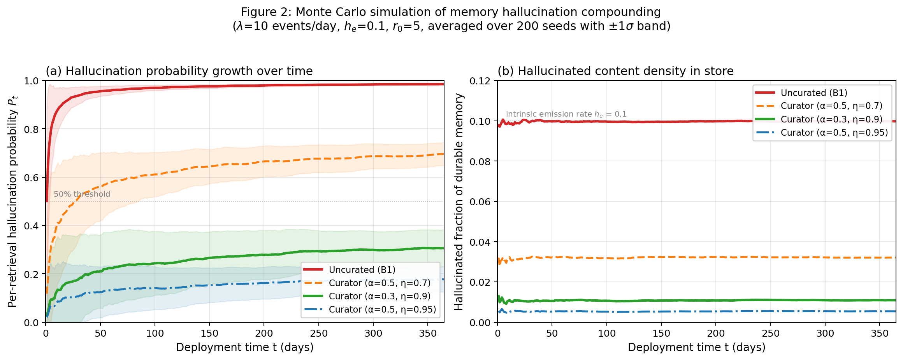
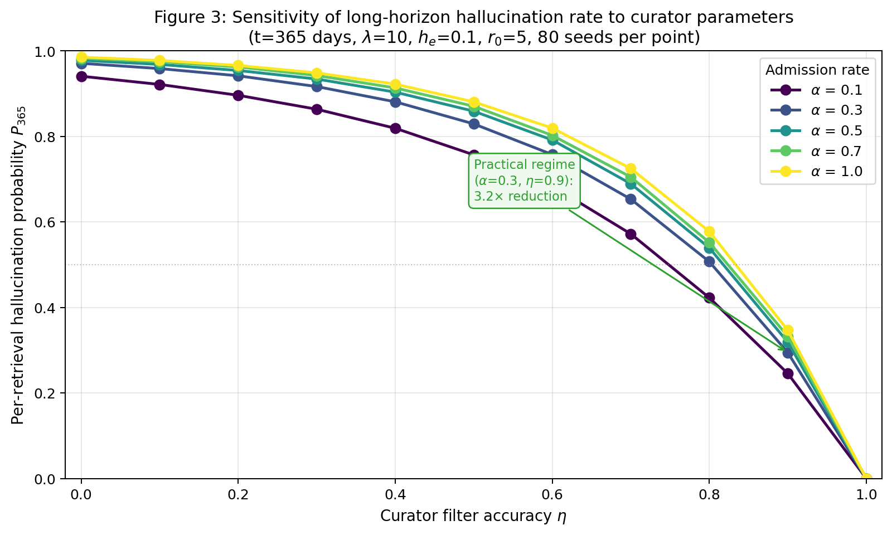
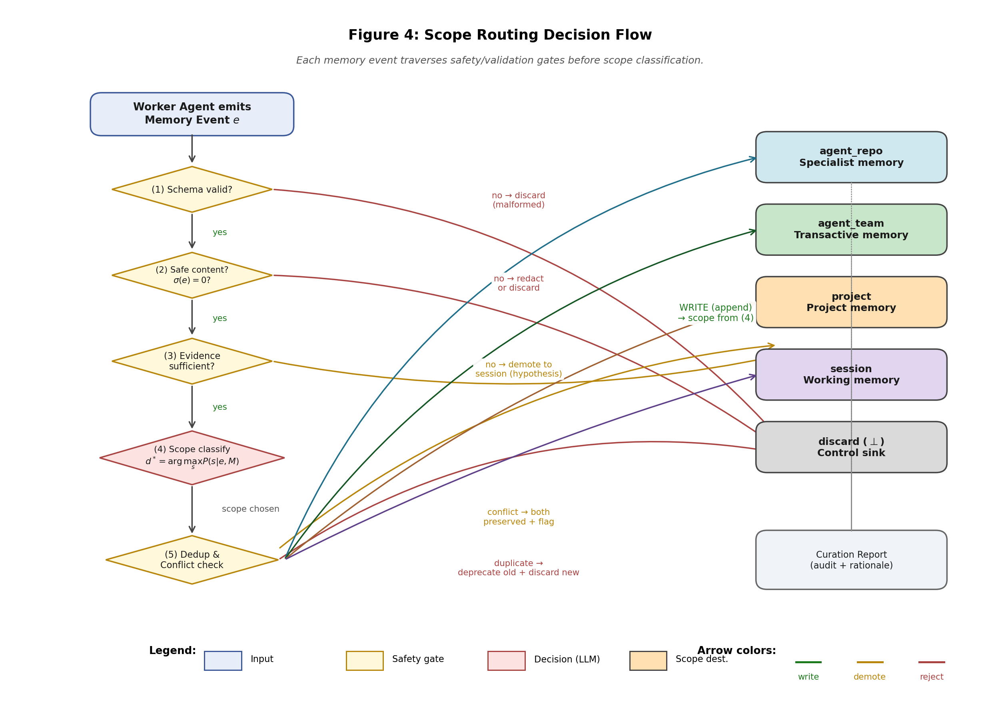
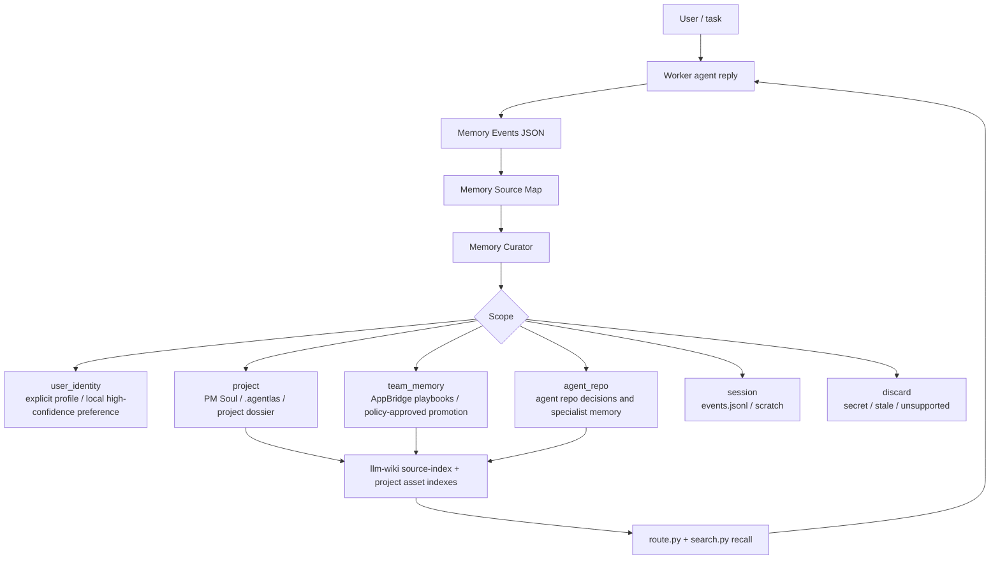

# Practical Memory Architecture Upgrade Report

Date: 2026-05-31

This report turns the Memory Curator paper into a production upgrade plan for
Agentlas. It uses the public Agentlas research repos, the live Agentlas Desktop
and AppBridge memory paths, and the observed retrieval failure where the agent
could not find the right memory even though the memory existed.

## Executive Finding

The failure mode is not "no memory". It is "unmapped memory". Agentlas already
has PM Soul files, Claude project memory, AppBridge shared memory, local
Desktop SQLite memory, `.agentlas/` project files, and `llm-wiki` registries.
The missing layer is a source map plus a unified scope contract that tells each
runtime which shelf is canonical, which index can see it, and who may promote a
fact from project memory to team memory.

## Evidence Base

| Source | Practical takeaway |
|---|---|
| `agent_memory_curator_agent` | Durable writes need admission control, scope routing, evidence, dedupe, and conflict handling. |
| `agent_project_pm_soul` | Long-running projects need one owner for current state, decisions, risks, and handoff continuity. |
| `agentlas_task_bias` | Agents overwork salient files/routes; a sitemap and priority policy keep uncovered surfaces visible. |
| `agentlas_org_chart` | Peer-to-peer agent graphs loop; hierarchy gives outcome ownership and escalation paths. |
| Agentlas Desktop live code | The app/CLI shipped a 4-scope memory model while AppBridge evolved to 5 scopes. |
| AppBridge live memory | Shared memory had stale release commands while Claude project memory had the correction. |
| `llm-wiki` live router/search | Agentlas Desktop was not a registered project, and natural-language memory queries missed existing files. |

## Research Repo Synthesis

Current public Agentlas repos under `github.com/jeongmk522-netizen` form one
architecture stack:

| Repo | Paper or system role | Production implication |
|---|---|---|
| `agent_memory_curator_agent` | Memory admission, scope routing, dedupe, and conflict control. | Owns the write gate; no durable write should bypass evidence/safety/scope checks. |
| `agent_project_pm_soul` | Project-level continuity and handoff ownership. | Project memory needs a PM Soul owner, not only runtime-local chat history. |
| `agentlas_task_bias` | Task-selection and file-coverage bias in agent work. | Memory recall must include sitemap/index coverage so salient logs do not crowd out neglected source roots. |
| `agentlas_org_chart` | Hierarchy-first coordination for multi-agent systems. | `team_memory` promotion needs a clear owner path: worker -> curator -> PM Soul/Policy Office. |
| `agentlas-desktop` | Runtime implementation for local teams and CLI. | Desktop/terminal must consume the same scope vocabulary and source map as the research papers. |

## System Graph

The original paper graphs remain the quantitative evidence layer and are used
directly in this production report.

<p align="center">
  
</p>

**Figure 2 practical reading:** without a curated write gate, repeated memory
turns compound error. The upgrade therefore makes curation an always-on release
gate, not an optional cleanup step.

<p align="center">
  
</p>

**Figure 3 practical reading:** recall quality depends on explicit curator
parameters: scope, evidence, owner, and retention policy. The source map makes
those parameters machine-readable.

<p align="center">
  
</p>

**Figure 4 practical reading:** scope routing is the system boundary. Production
Agentlas extends the historical four-scope paper model with `user_identity` and
renames `agent_team` to `team_memory` while preserving the old name as an alias.

The graph below is the operational upgrade graph for production systems.



## Practical Upgrade

### 1. Add a Memory Source Map

Every Agentlas surface needs a machine-readable map containing:

- project id and surface (`web`, `desktop`, `terminal`, `appbridge`, or public research repo)
- canonical memory roots
- index/search path that can see each root
- write owner
- promotion path
- secret/noise excludes

This prevents "memory exists but route/search cannot see it".

### 2. Standardize Five Scopes

Canonical scopes are:

| Scope | Production meaning | Default owner |
|---|---|---|
| `user_identity` | durable operator profile/preferences | user or explicit local profile gate |
| `team_memory` | cross-project/HQ playbooks and routing rules | Policy Office / Memory Curator promotion |
| `project` | one project or engagement's state | PM Soul |
| `agent_repo` | one agent/repo's reusable behavior | agent/repo owner |
| `session` | current task scratch | runtime event log |
| `discard` | terminal rejection | Memory Curator |

`agent_team` remains a compatibility alias for `team_memory`.

### 3. Promote Corrections Explicitly

Corrections should not stay trapped in a runtime-local folder. When a project
memory contradicts shared memory, Memory Curator writes a conflict event and
promotes the correction through the owner path:

```text
Claude project memory correction
  -> Memory Curator conflict
  -> project PM Soul or Policy Office approval
  -> shared team_memory / llm-wiki project dossier update
  -> route/search smoke test
```

### 4. Treat Search And Routing As Release Gates

Architecture work is not complete until these checks pass:

```bash
python3 "$AGENTLAS_LLM_WIKI_ROOT/scripts/ingest.py"
python3 "$AGENTLAS_LLM_WIKI_ROOT/scripts/route.py" "Agentlas Desktop memory curator release memory"
python3 "$AGENTLAS_LLM_WIKI_ROOT/scripts/search.py" --limit 5 "Agentlas Desktop release notarization"
python3 "$AGENTLAS_LLM_WIKI_ROOT/scripts/search.py" --limit 5 "memory curator five layer team memory"
```

## Four-Surface Application

| Surface | Upgrade |
|---|---|
| Web | Generated agent bundles should include the 5-scope emitter contract and `memory-map.json` so exported repos do not recreate the 4-scope gap. |
| Desktop app | `electron/architecture/manifest.ts`, deterministic curation, and context injection should understand `user_identity` and `team_memory`. |
| Terminal | `cli/architecture.data.json` and CLI curation should mirror the same scopes and retrieval rules as Desktop. |
| AppBridge | `llm-wiki` must register Agentlas surfaces and Claude project memory roots; Memory Curator treats stale shared memory as conflict/promotion work. |

## Acceptance Criteria

- Agentlas surfaces are registered in `llm-wiki/registry/projects.json`.
- `route.py` classifies Agentlas memory work as an Agentlas project, not generic AppBridge.
- `search.py` finds relevant memory using natural-language terms without requiring exact path knowledge.
- Desktop/terminal memory scopes accept the 5-layer vocabulary.
- AppBridge Memory Curator docs use `team_memory` as canonical and `agent_team` only as legacy alias.
- Stale release-memory guidance is corrected in shared memory.
